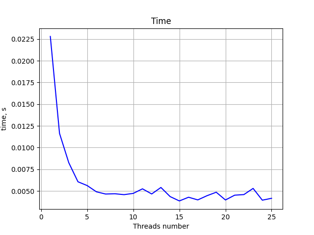
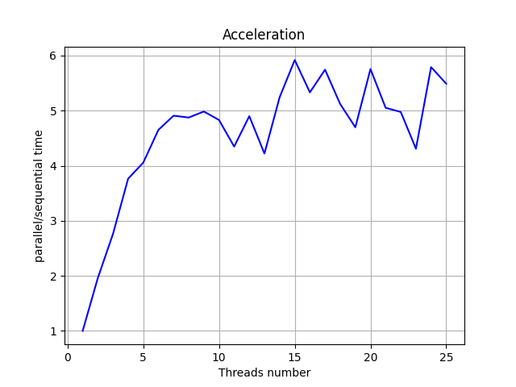
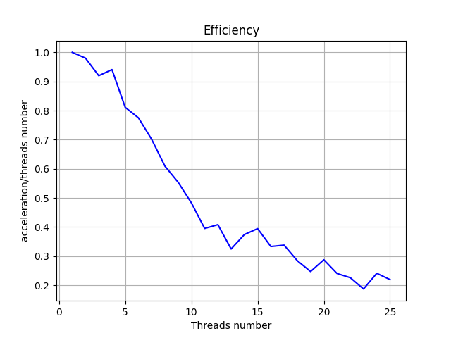

# Parallel numerical integration of improper integrals

This project is a C language implementation of numeric integration using pthreads to compute improper integrals. The program uses parallelization to speed up the computation process and improve efficiency.     
## Usage
As an example, the function `f(x) = sin(1/x)` is taken on the border from `0.01` to `5` (As you can see from the code below)

To select a different function with a different integration limit, write the left limit to `a`, the right limit to `b`, and write your function to `f` in `main.c`, as in the code below:
```
#define a 0.01L
#define b 5.0L
typedef long double DOUBLE;
static inline DOUBLE f(DOUBLE x){return sinl(1/x);}
```

Also, if the selected function has changed, please comment this code, because this is the exact answer for this example function only.
Or write the exact answer for your integral
```
DOUBLE accurate_ans = 2.035467080916575L;
printf("Accurate answer: %.20Lf\n", accurate_ans);
printf("Err: %.20Lf\n", fabsl(global_sum - accurate_ans));
```

Below is the output of the program, where the first line is the calculation time
```
0.0671310000
Calculated integral: 2.03546708107855254003
Accurate answer: 2.03546708091657491124
Err: 0.00000000016197762879

```


## Installation
To install this program, clone the repository
```
git clone https://github.com/olisvalue/tree/main/Integration
cd Integration
```

## How to compile and run

### To compile the program, type
``
gcc main.c -pthread -lm -o integrate 
``
### To execute the compiled binary file, type
``
./integrate n_threads accuracy
``

where:
- `<n_threads>` is the number of threads for parallel compute,
- `<accuracy>` is the maximum numerical integration error
## Graphs

### Python script `makegraph.py` generates three graphs to illustrate the performance characteristics of the parallel implementation:

- Time: shows the execution time for different numbers of threads
- Acceleration: shows the speedup achieved by using multiple threads compared to a single-threaded implementation
- Efficiency: shows the efficiency of the parallel implementation as the number of threads increases

### To run this script, type
`python3.9 makegraph.py n_threads accuracy`    

The program will build graphs for the execution number of threads from 1 to `n_threads`   
Let `accuracy` be 10e-5 or less to see the performance of a parallel implementation

### Performance charts are attached below

    
   

