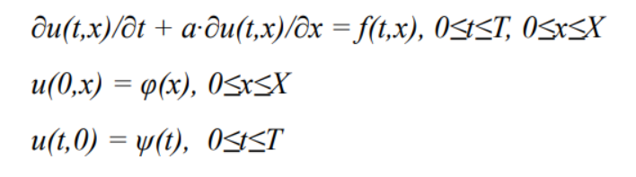
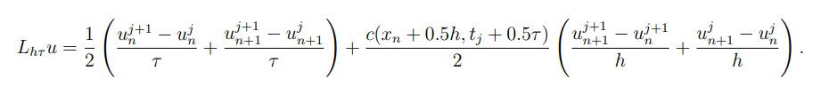
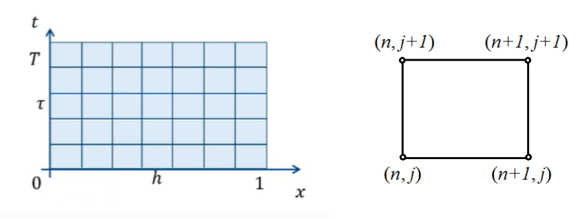
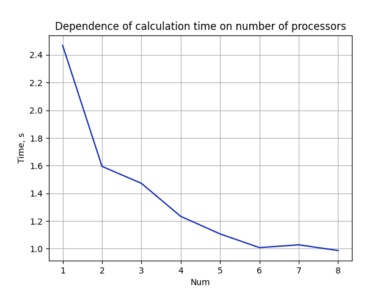
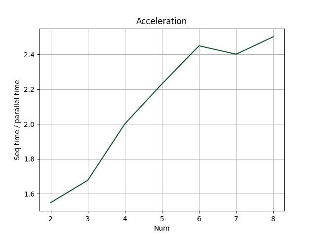
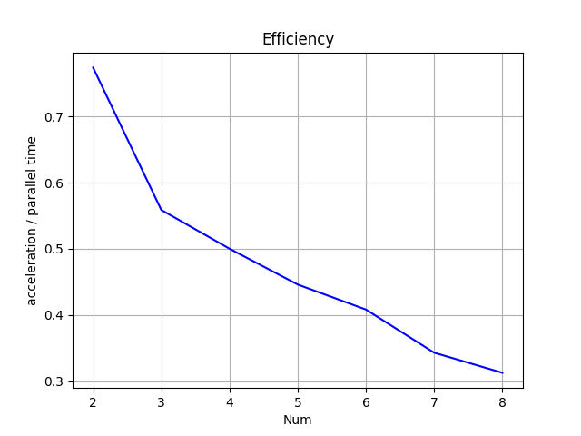

## This repository contains solution of transport equation, which has the following form:
   
Here is the shape of the difference scheme used (rectangle scheme):      
    
Here is a schematic diagram of the calculation and grid scheme:
  
There are sequential and parallel realizations.

## There are attached graphs showing the time, acceleration and efficiency of the parallel algorithm  
   
   
   